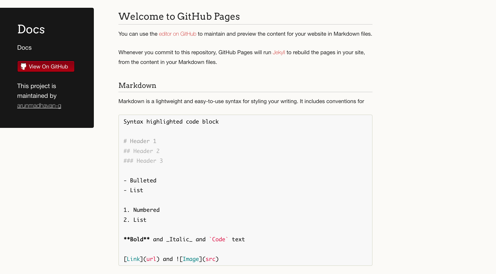

# How to create a page with github pages?

## 1. Login to Github and create a Repository

## 2. Create a new Repository with a README

## 3. Click on the settings tab in the newly created Repository

## 4. Scroll down to show Github pages

## 5. Choose a theme and select master as Source

## 6. Select the URL from the created pages

## 7. Open the URL in a browser

## 8. To add content, you can use a tool such as gitpod.io. Open in a browser https://gitpod.io/#https://github.com/<repo-url>

## 9. Edit the content of README.md using markdown. You can turn on the preview mode by clickon on the top right handside eye icon.

## 10. Commit the changes using Git tab.

## Useful links

For writing style use [markdown](https://www.markdownguide.org/)
For the code edit use [gitpod](https://www.gitpod.io/)

